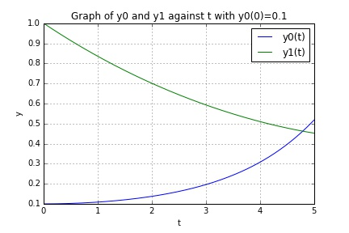
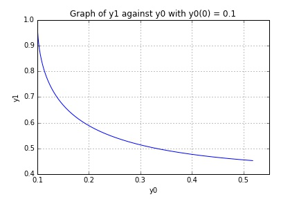
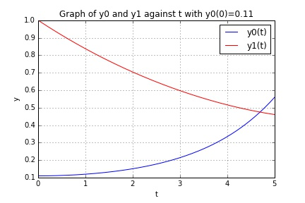
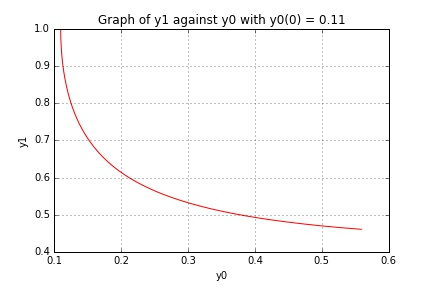

UECM3033 Assignment #3 Report
========================================================

- Prepared by: Ching June Tao
- Tutorial Group: T2

--------------------------------------------------------

## Task 1 --  Gauss-Legendre formula

The reports, codes and supporting documents are to be uploaded to Github at: 

[https://github.com/chingjunetaoUTAR/UECM3033_assign3](https://github.com/chingjunetaoUTAR/UECM3033_assign3)

Explain how you implement your `task1.py` here.

An integral over [a,b] must be changed into an integral over [-1,1] before applying the Gaussian quadrature rule. This interval transformation can be done in the following way.

$$ u = T(x) = \frac{b-a}{2}x + \frac{b+a}{2} $$

$$\int_a^{b}f(x) dx= \frac{b-a}{2}\int_{-1}^{1} f(\frac{b-a}{2}x + \frac{a+b}{x} )  dx$$ 

Applying the Gaussian quadrature rule then results in the following approximation.

$$\int_a^{b}f(x) dx= \frac{b-a}{2}\sum_{i=1}^{n} w_i f(\frac{b-a}{2}x_i + \frac{a+b}{x} ) $$

The above calculation is done by using the following python code.
transformed_x = (b-a)*x/2 + ((b+a)/2)    
ans = ((b-a)/2)*sum(w*f(transformed_x))

Explain how you get the weights and nodes used in the Gauss-Legendre quadrature.

$$ x_i $$ and $$ w_i $$ can be obtained by the polynomial module in python. The function is stated below.

x,w = np.polynomial.legendre.leggauss(n)

---------------------------------------------------------

## Task 2 -- Predator-prey model

Explain how you implement your `task2.py` here, especially how to use `odeint`.

A ODE system (biological_system is) created and the following differential equations is defined in the system.
$$ y'_0 = a(y_0 - y_0 y_1)$$
$$ y'_1 = b(-y_1 + y_0 y_1)$$

Initial values condition is defined as below.
y_initial = [0.1, 1.0]

The time from 0 to 5 years is defined by using linspace function in order to plot a smooth line graph.
t = np.linspace(0,5,150)
The odeint module in python is used to solve the ODE system. The function in python is defined below.
sol = odeint(biological_system,y_initial,t,args=(a, b))
The solution is obtained and graph is plotted in the next section.

Put your graphs here and explain.
y0 is the number of prey while y1 is the number of predators.

 

The graph above shows that number of prey, y0 and the number of predator,y1 with year, t when the initial value condition y0(0)=0.1.
We can see that the number of prey increase when the number of predator decreases. 

 

The relationship of number of prey,y0 and number of predator,y1 can be explained in the graph above.
We can see that there is a inverse relationship between y0 and y1.

When the initial valus condition y0(0) change to 0.11.

 

 

Is the system of ODE sensitive to initial condition? Explain.

This system of ODE is not sensitive to the initial condition. There is only a small change in the graph when the initial value condition change from 0.1 to 0.11. 
Therefore, this system of ODE is not sensitive to the initial condition. 

-----------------------------------

last modified: 16/4/2016 
